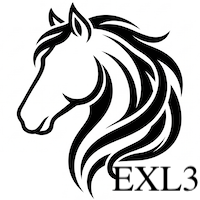
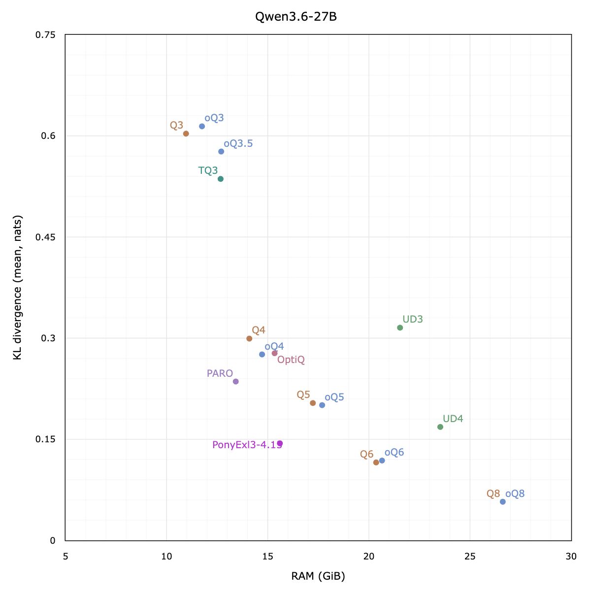
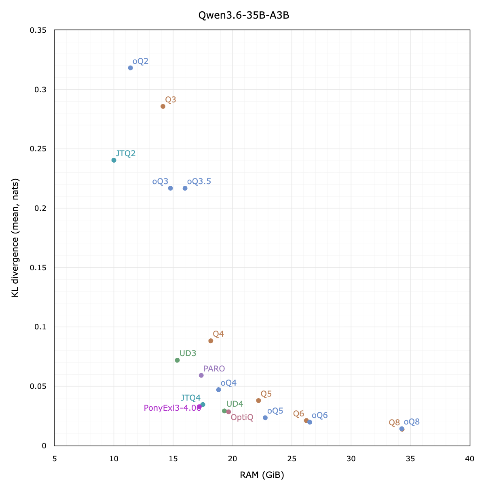
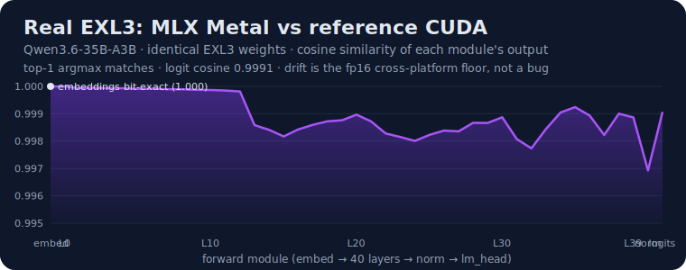

<p align="center">
  <picture>
    <source media="(prefers-color-scheme: dark)" srcset="docs/assets/ponyexl3-dark.png">
    
  </picture>
</p>

# PonyExl3

EXL3 quantized LLM inference on Apple Silicon, built on [MLX](https://github.com/ml-explore/mlx) and [mlx-lm](https://github.com/ml-explore/mlx-lm).

PonyExl3 ports the [ExLlamaV3 EXL3](https://github.com/turboderp-org/exllamav3) format to Metal: weights stay in low-bit trellis form and are decoded on-the-fly inside fused GEMV/GEMM kernels instead of being materialized as full fp16 matrices. A CPU reference implementation (`ponyexl3.ref`) mirrors the CUDA codec for bit-exact validation.

**Platform:** macOS with Apple Silicon (Metal required for inference).  
**Status:** Alpha — inference-focused; HF→EXL3 conversion is experimental (`ponyexl3/convert/`).

---

## Performance

Decode throughput in tok/s — greedy, and **verify-gated** so every speculative mode
emits output token-identical to plain greedy. Measured on an Apple M5 Max (128 GB) and
a 32 GB M1 Max, same EXL3 checkpoints ([UnstableLlama](https://huggingface.co/UnstableLlama)).
**Bold** = fastest in that row.

| Model | Hardware | plain | EAGLE-3 | MTP | DFlash | prefill (8k) | resident |
|-------|----------|------:|--------:|----:|-------:|-------------:|---------:|
| **Qwen3.6-27B · 4.15bpw** | M5 Max | 16.6 | 24.2 | 28.3 | **37.8** | 662 | 15.1 GB |
|  | M1 Max | 4.0 | — | 8.7 | **15.0** | 126 | 15.1 GB |
| **Qwen3.6-35B-A3B · 4.00bpw** | M5 Max | 68.5 | **79.8** | — | — | 2775 | 17.2 GB |
|  | M1 Max | 23.5 | ~flat | — | — | 497 | 17.2 GB |
| **Qwen3.6-27B · 8.00bpw** | M5 Max | 15.6 | — | — | **31.6** | 642 | 26.3 GB |

4-bit weights stay resident and decode in-kernel (the 27B runs in ~15 GB). Speculation
pays off *more* on the slower GPU for the dense model — DFlash is **3.75×** on the M1 Max
(4.0 → 15.0) vs 2.28× on the M5 Max — but barely moves the MoE (already fast per token).
Draft-free n-gram lookup is workload-dependent (+16% on code edits, ~neutral on novel
text), so it's not tabled. Reproduce with `tools/bench/perf_chart_bench.py`; accuracy
is [below](#accuracy).

**At temperature 0.6** the same drafters stay **distribution-exact** (Leviathan-Chen
rejection sampling, not greedy — see [Speculative decoding](#speculative-decoding)).
Decode tok/s on the M5 Max (sampling is stochastic, so these wobble run-to-run; the
output *distribution* is exact vs plain sampling):

| Model | plain | EAGLE-3 | MTP | DFlash |
|-------|------:|--------:|----:|-------:|
| Qwen3.6-27B · 4.15bpw | 17.5 | 19.7 | 20.5 | **25.1** |
| Qwen3.6-35B-A3B · 4.00bpw | **67.8** | 57.9 | — | 31.1 |

DFlash leads the 27B (**1.4×** over plain). On the MoE, plain decode is already fast
enough that the host-coupled accept overhead makes speculation net-negative — run it
greedy there, or skip the drafter at temperature.

### vs RTX 4090 (same EXL3 weights)

The identical EXL3 checkpoints through exllamav3 on an RTX 4090. The platforms split by
axis: the 4090 wins **prefill** on raw compute (2–3×); the M5 Max wins or ties **decode**
— the latency-bound regime that gates interactive use — outright on the MoE.

| metric (8k context) | 27B · M5 Max | 27B · RTX 4090 | 35B-A3B · M5 Max | 35B-A3B · RTX 4090 |
|---------------------|------------:|---------------:|-----------------:|-------------------:|
| prefill tok/s       | 662 | 2306 | 2775 | 6140 |
| decode, plain       | 16.6 | 33 | **68.5** | 52 |
| decode, + drafter   | 38 (DFlash) | — | 80 (EAGLE-3) | — |
| memory              | 15.1 GB | 15.9 GB | 17.2 GB | 17.6 GB |

RTX 4090 figures are exllamav3 plain TG (no drafter); the M5 Max drafters are
verify-gated. The M5 Max is a 128 GB laptop SoC — it holds the 4090 on decode while
fitting far larger models than the 4090's 24 GB.

---

## Speculative decoding

Four drafters, all **verify-gated**: the target model checks every proposed token, so
they buy speed, never trade quality. At `--temp 0` the output is **identical to plain
greedy**; at `--temp > 0` the verify switches to Leviathan-Chen rejection sampling, so
the stream is **distribution-exact vs plain sampling** at that temperature (`q` drafted,
accepted with `min(1, p/q)`, bonus resampled from `(p−q)₊`). Numbers below are
**Qwen3.6-27B 4.15bpw, M5 Max, greedy** (model-based drafters add `--draft-w4`, free
since draft tokens never reach the output stream; at temp 0.6 the same drafters run
~21–29 tok/s, distribution-exact).

| Method | flag | tok/s | vs plain | tok/cycle | what it is |
|--------|------|------:|---------:|----------:|------------|
| Plain greedy | — | 16.6 | 1.00× | — | one forward per token |
| N-gram lookup | `--lookup` | ~17 (**+16% on edits**) | up to ~1.4× | — | draft-free; suffix-index over prompt+output |
| EAGLE-3 | `--eagle3 <path>` | 24.2 | 1.46× | 2.29 | autoregressive draft head over target features |
| MTP | `--mtp auto` | 28.3 | 1.70× | 2.74 | multi-token-prediction head |
| **DFlash** | `--dflash <path>` | **37.8** | **2.28×** | 4.80 | block drafter — one masked-block forward per cycle |

- **DFlash** is the strongest here (≈4.8 accepted tokens per verify cycle). **MTP**
  needs only the head bundled with the checkpoint (`--mtp auto`). **EAGLE-3** and
  DFlash take a separate drafter checkpoint (see [Speculative drafters](#speculative-drafters)).
- **N-gram lookup** needs no weights and no setup — it proposes continuations seen
  earlier in the prompt/output, so it shines on code edits and repetition and is
  ~neutral on novel prose (an adaptive floor keeps it from ever hurting).
- All compose with the 8 bpw target, and speculation pays off **more** on slower
  silicon for the dense model: on a 32 GB M1 Max, DFlash takes the 27B from
  4.0 → **15.0 tok/s** (3.75×, vs 2.28× on the M5 Max) because plain decode is so
  ALU-bound there. The MoE is the opposite — already fast per token, so speculation
  barely moves it.

---

## Accuracy

Two axes, both measured on this machine.

**Quantization quality — KLD vs bf16.** How far each quant's next-token distribution
drifts from the original bf16 model (16×8192 windows; lower-left is better), plotted
against the field of MLX quants — `Q` (mlx-lm), `oQ` (optiq), and others — on the
[mlx-eval](https://github.com/deepsweet/mlx-eval) harness. **PonyExl3** (violet) sits on
the lower-left frontier: less divergence at less memory than the comparable-bit points.

<p align="center">
<br>
<sub><a href="https://huggingface.co/UnstableLlama/Qwen3.6-27B-exl3-4.15bpw">Qwen3.6-27B · PonyExl3 point = 4.15 bpw EXL3 by UnstableLlama ↗</a></sub>
</p>

<p align="center">
<br>
<sub><a href="https://huggingface.co/UnstableLlama/Qwen3.6-35B-A3B-exl3-4.00bpw">Qwen3.6-35B-A3B · PonyExl3 point = 4.00 bpw EXL3 by UnstableLlama ↗</a></sub>
</p>

| Model | KLD vs bf16 | Acc@1 | RAM | vs general quant at similar RAM |
|-------|------------:|------:|----:|---------------------------------|
| 27B EXL3 4.15bpw | 0.144 | 0.591 | 15.1 GB | ½ the KLD of Q4 (0.299) / oQ4 (0.276) |
| 27B EXL3 8.00bpw | 0.042 | 0.595 | 26.3 GB | below Q8 / oQ8 (0.057); PPL ≈ bf16 |
| 35B-A3B EXL3 4.00bpw | 0.033 | 0.627 | 17.2 GB | below Q4 (0.088) and oQ4 (0.047) |

**Engine fidelity — vs reference CUDA.** PonyExl3 is *real* EXL3: the MLX Metal forward
reproduces the canonical CUDA exllamav3 forward on identical weights to the fp16
cross-platform floor — cosine ≥ 0.997 through all 40 layers, top-1 argmax match,
embeddings bit-exact. Full audit: [docs/drifts_investigation.md](docs/drifts_investigation.md).

<p align="center">
<br>
<sub><a href="https://huggingface.co/UnstableLlama/Qwen3.6-35B-A3B-exl3-4.00bpw">Qwen3.6-35B-A3B · 4.00 bpw — EXL3 quant by UnstableLlama ↗</a></sub>
</p>

KLD measured with **[mlx-eval](https://github.com/deepsweet/mlx-eval) by
[deepsweet](https://github.com/deepsweet)** (`mlx_eval.compare`, 16×8192 windows, bf16
reference) — the harness and the Q / oQ / UD / PARO / OptiQ baseline data are theirs.
Raw per-window output for each EXL3 model:
[27B 4.15bpw](docs/kld-results/Qwen3.6-27B-exl3-4.15bpw.txt) ·
[27B 8.00bpw](docs/kld-results/Qwen3.6-27B-exl3-8.00bpw.txt) ·
[35B-A3B 4.00bpw](docs/kld-results/Qwen3.6-35B-A3B-exl3-4.00bpw.txt).
Engine fidelity via `ponyexl3/reference/compare_trace.py`.

---

## Features

- **Exact EXL3 decode path** — fused Metal GEMV at batch size 1; lowest memory footprint
- **Full model loader** — Qwen3.5 / Qwen3.6 dense and MoE architectures via mlx-lm skeleton + `EXL3Linear` swap
- **Speculative decoding** — MTP, DFlash, EAGLE-3, and draft-free n-gram lookup (all verify-gated for token-identical greedy output)
- **Dual implementation + pytest parity** — every MLX primitive has a CPU `ref/` twin
- **Cross-platform reference** — CUDA-exported `.npz` fixtures for logits and per-layer bisection (`ponyexl3/reference/`)

---

## Requirements

- macOS on Apple Silicon (M-series)
- Python ≥ 3.14 (tested on 3.14.5)
- **Memory** (unified RAM):

  | Model | resident | load peak | runs on |
  |-------|---------:|----------:|---------|
  | Qwen3.6-27B 4.15bpw | ~17 GB | ~27 GB | 32 GB |
  | Qwen3.6-35B-A3B 4.00bpw | ~17 GB | ~19 GB | 32 GB |
  | Qwen3.6-27B 8.00bpw | ~27 GB | ~30 GB | 48 GB+ |

  The loader frees each layer's source tensors as it converts them, releases
  fused members per group, and drops the host-side trellis once the device
  runtime owns it. So the load transient stays near the resident footprint
  (a 15 GB model loads in ~27 GB, not ~42 GB), and ~4.6 GB stays free for the
  KV cache (~225k tokens of 27B context) instead of a dead host copy.

  **Wired-memory cap.** Apple Silicon kills a process that wires more than the
  GPU's working-set limit (~26.5 GB on a 32 GB Mac), and MLX's buffer cache
  would otherwise grow past it during a heavy load. The loader caps MLX at 92%
  of the device's recommended working set so it evicts cache and stays under
  that ceiling instead of being killed. Override with `PONYEXL3_MEM_LIMIT_GB`
  (e.g. `=26` if you know your exact limit; `=0` to disable the cap).

  Other knobs for tight memory: `EXL3_FUSE_MIN_MB=999999` skips sibling fusion
  (lower load peak, slightly slower decode); `EXL3_WCACHE=1` keeps the host
  trellis (needed only for the fp16-fold reconstruct path).

---

## Install

```bash
git clone https://github.com/beamster/ponyexl3.git
cd ponyexl3

python3 -m venv .venv
source .venv/bin/activate
pip install -e ".[dev]"
```

No Pony monorepo or `PYTHONPATH` setup is needed. Everything imports as `ponyexl3`.

---

## Quick start

Point at a local EXL3 checkpoint directory (safetensors + `quantization_config.json` with `quant_method: exl3`):

```bash
ponyexl3-generate /path/to/Qwen3.6-27B-exl3-4.15bpw \
  -p "Why is the sky blue?" -n 256
```

Greedy decoding (`--temp 0`, default) is the validated path. Use `--raw` to skip the chat template.

### Engines

| Engine | Memory | Speed | Exactness |
|--------|--------|-------|-----------|
| `exl3` (default) | Lowest | Fastest decode | Bit-exact vs trellis |
| `fold16` | Higher | Fast | Exact fp16 fold of public weights |
| `w8a16` / `w4a16` | Medium | Faster matmul | **Lossy** — run `ponyexl3-compare-engines` first |

```bash
ponyexl3-generate /path/to/model --engine fold16 -p "Hello" -n 128
ponyexl3-compare-engines /path/to/model --engines exl3 fold16 w8a16 -n 64
```

Throughput sweep (prefill 1k–32k, 128-token decode per row; default prompt `README.md`):

```bash
ponyexl3-generate-bench /path/to/model --raw
ponyexl3-generate-bench /path/to/model --dflash /path/to/dflash --mtp off --json
ponyexl3-generate-bench /path/to/model --prompt-file my_prompt.txt --warmup
```

### Speculative decoding

All speculative modes verify drafts against the main model — greedy output stays token-identical.

```bash
# MTP draft head (auto-discovers weights in model dir)
ponyexl3-generate /path/to/model --mtp auto --draft 3 -p "..." -n 256

# DFlash block drafter (bf16 or EXL3; default draft width 7)
ponyexl3-generate /path/to/model \
  --dflash /path/to/Qwen3.6-27B-DFlash-bf16 -p "..." -n 256

# Draft-free n-gram lookup (no extra weights; greedy only)
ponyexl3-generate /path/to/model --lookup -p "..." -n 256
```

---

## CLI tools

Installed by `pip install -e .`:

| Command | Purpose |
|---------|---------|
| `ponyexl3-generate` | End-to-end text generation |
| `ponyexl3-generate-bench` | Prefill/decode throughput sweep (1k–32k context, 128 gen) |
| `ponyexl3-compare-layer` | Per-layer correctness ladder (probe → tile → slice → forward) |
| `ponyexl3-compare-engines` | End-to-end engine agreement + logit drift report |

Layer comparison — start with `--probe` on large models (full forward can take tens of minutes per layer on 27B-class checkpoints):

```bash
ponyexl3-compare-layer /path/to/model MODULE --probe
ponyexl3-compare-layer /path/to/model MODULE --mode tile
ponyexl3-compare-layer /path/to/model --list
```

Synthetic fixture (no checkpoint download):

```bash
python -m ponyexl3.cli.generate_synthetic_layer
```

---

## Supported models

Any EXL3-quantized checkpoint whose `model_type` is `qwen3_5` or `qwen3_5_moe`
loads — i.e. the **Qwen3.5 / Qwen3.6 dense and MoE families, at any size**
(other architectures raise `no architecture mapping`). The checkpoints below
are the ones validated end-to-end:

| Model | `model_type` | Notes |
|-------|--------------|-------|
| [Qwen3.6-27B dense (4.15bpw)](https://huggingface.co/UnstableLlama/Qwen3.6-27B-exl3-4.15bpw) | `qwen3_5` | Primary ship target (~15 GB RAM) |
| [Qwen3.6-27B dense (8.00bpw)](https://huggingface.co/UnstableLlama/Qwen3.6-27B-exl3-8.00bpw) | `qwen3_5` | Near-lossless; decodes at 4.15bpw speed (~27 GB RAM) |
| [Qwen3.6-35B-A3B MoE](https://huggingface.co/UnstableLlama/Qwen3.6-35B-A3B-exl3-4.00bpw) | `qwen3_5_moe` | `EXL3MoEBlock` / fused expert kernels (~19.5 GB RAM) |
| [Qwen3.5-2B](https://huggingface.co/UnstableLlama/Qwen3.5-2B-exl3-4.00bpw) | `qwen3_5` | Dev / fast iteration (dense) |

Checkpoints must be EXL3-quantized (ExLlamaV3 or compatible converter output)
with a sidecar `quantization_config.json`.

### Speculative drafters

Optional verify-gated drafters that pair with a base model (greedy output
stays token-identical — the drafter only proposes; the base model checks).
These are **not** standalone models; pass them via the matching flag:

| Drafter | Flag | Pairs with |
|---------|------|-----------|
| [Qwen3.6-27B-MTP](https://huggingface.co/turboderp/Qwen3.6-27B-MTP-exl3) | `--mtp <path>` (or `--mtp auto`) | 27B dense |
| [Qwen3.6-27B-DFlash](https://huggingface.co/turboderp/Qwen3.6-27B-DFlash-exl3) | `--dflash <path>` | 27B dense |
| [specdrift Qwen3.6-27B EAGLE-3](https://huggingface.co/Dogacel/specdrift-qwen3.6-27b-eagle3) | `--eagle3 <path>` | 27B dense |

`--lookup` (draft-free n-gram) needs no extra weights. Add `--draft-w4` to run
any drafter's head/body in w4 — draft-side only, so output bits are unchanged.

---

## Testing

```bash
pytest tests/ -q
```

**171 tests** run without any model on disk (synthetic layers + CPU/MLX parity). Optional integration tests are skipped unless env vars are set:

```bash
export PONYEXL3_MODEL_DIR=/path/to/checkpoint
export PONYEXL3_MODEL_27B=/path/to/27b-exl3
export PONYEXL3_MODEL_2B=/path/to/2b-exl3
export PONYEXL3_REFERENCE_NPZ=/path/to/reference.npz   # see below

pytest tests/ -q
```

### Reference parity (CUDA ↔ MLX)

The reference *scripts* ship in `ponyexl3/reference/`; the binary reference
bundle (logits/trace/linear-io/moe `.npz`) is generated on a CUDA host running
exllamav3 and is **not** bundled in this repo (it is model-derived and
host-specific). Produce one with the export tools, then replay and diff on Mac:

```bash
PONYEXL3_MODEL_DIR=/path/to/Qwen3.6-35B-A3B-exl3-4.00bpw \
  python ponyexl3/reference/compare_reference.py /path/to/reference.npz
```

The cross-platform forward has been audited — see
[`docs/drifts_investigation.md`](docs/drifts_investigation.md) (verdict: PASS,
within the fp16 cross-platform floor). The full CUDA export + replay workflow,
including the scale-aware `compare_trace.py` analysis, is in
[`ponyexl3/reference/README.md`](ponyexl3/reference/README.md).

---

## Project layout

```
ponyexl3/
  ref/              CPU/numpy golden codec (trellis, codebook, Hadamard, loader)
  mlx/              MLX runtime — Metal kernels, model loader, generation loop
  reference/        Cross-platform parity export/compare scripts (bundle not shipped)
  convert/          Experimental HF → EXL3 conversion (not v0.1)
  cli/              Installed command-line entry points
tools/
  bench/            Throughput and kernel benchmarks (env-var model paths)
  dev/              Diagnostics, A/B probes, parity repair
tests/              Pytest parity suite
docs/               Dev log and conversion design notes
```

---

## How it works

EXL3 stores each linear layer as independent **16×16 tiles** of K-bit trellis indices plus per-channel sign scales (`suh`, `svh`) and optional Walsh-Hadamard transforms (block size 128). Weights are recovered procedurally via **3-instruction codebooks** — the same inline decode used on CUDA, not a stored LUT.

At inference time PonyExl3 routes by batch size and layer size:

- **Decode (M=1):** fused Metal GEMV — decode trellis bits and dot in one kernel launch
- **Prefill (M>1):** decode-once weight cache + compiled `matmul`, or fused GEMM for huge layers
- **MoE:** fused gate/up/down kernels over selected experts instead of hundreds of tiny matmuls

A custom generation loop (`ponyexl3.mlx.generate`) runs prefill through the text model only and applies `lm_head` to the last position per step — critical for 27B-class models where the head alone is multi-GB.

---

## Environment variables

| Variable | Used by |
|----------|---------|
| `PONYEXL3_MODEL_DIR` | `compare_reference`, `test_reference_parity` |
| `PONYEXL3_MODEL_27B` | 27B integration tests, `tools/bench/*` |
| `PONYEXL3_MODEL_2B` | 2B GEMV layer tests |
| `PONYEXL3_MTP_DIR` | MTP benchmarks |
| `PONYEXL3_REFERENCE_NPZ` | Full-model reference parity test |
| `MODEL` / `MTP` | Legacy aliases for bench scripts |

Common runtime tuning knobs (all optional; defaults are the shipped path):

| Variable | Effect |
|----------|--------|
| `EXL3_FUSE_MIN_MB` | Skip fusing layers below this weight size (lower load peak) |
| `EXL3_WCACHE` | Keep host-side trellis after device upload (fp16-fold path) |
| `EXL3_FUSE_POST` | Fused post-Hadamard in GEMV kernel |
| `EXL3_MLP_MONO` | Experimental monolithic MLP kernel |
| `PONYEXL3_MEM_LIMIT_GB` | Cap MLX wired memory (see [Requirements](#requirements)) |

---

## Development

```bash
# Metal codebook POC
python -m ponyexl3.mlx.metal_codebook_poc

# Bench scripts (require checkpoint env vars)
export PONYEXL3_MODEL_27B=/path/to/27b-exl3
python tools/bench/benchmark_forward.py "$PONYEXL3_MODEL_27B"
```

Internal bench/dev scripts are described in [`tools/README.md`](tools/README.md).

---

## Attribution

- **EXL3 codec and algorithm** — [ExLlamaV3](https://github.com/turboderp-org/exllamav3) (turboderp)
- **Model weights** — Qwen series (Alibaba Cloud); follow each checkpoint's license
- **Runtime** — [MLX](https://github.com/ml-explore/mlx), [mlx-lm](https://github.com/ml-explore/mlx-lm)
- **KLD accuracy harness + baseline data** — [mlx-eval](https://github.com/deepsweet/mlx-eval) (deepsweet)

---

## License

Apache-2.0 — see [`LICENSE`](LICENSE).
