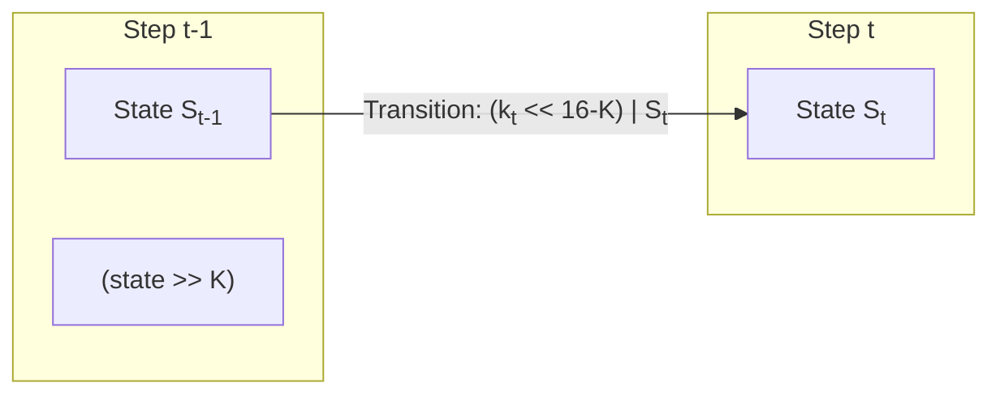
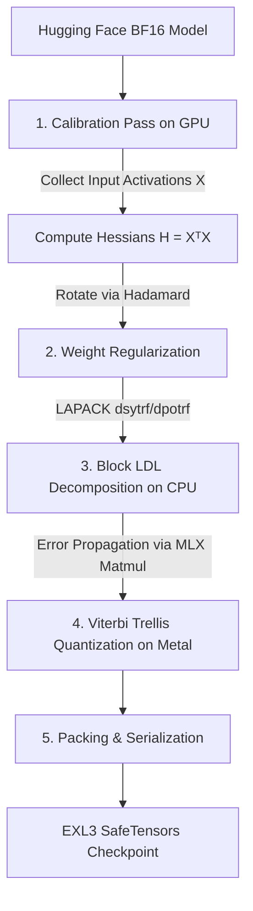

# EXL3 Format Conversion: Metal Porting Plan

This document details the plan to port the EXL3 format conversion and quantization tools from PyTorch/CUDA (`exllamav3/exllamav3/conversion`) to MLX/Metal (`pony/exl3`). 

---

## 1. How the Codec Works

The EXL3 format is a low-bit quantization method designed for high-performance LLM inference on modern GPUs. Unlike standard uniform or affine quantization methods (like round-to-nearest GGUF or AWQ), EXL3 treats quantization as a sequence search problem, finding the optimal set of discrete weights along a Viterbi trellis.

### 1.1 Structural Layout
Weights in a linear layer are organized into independent **16×16 tiles** (256 elements each). The quantized layer is reconstructed using:
- **`suh` (Input Scales)**: A vector of FP16 scales (one per input feature) that flips signs and scales input activations.
- **`svh` (Output Scales)**: A vector of FP16 scales (one per output feature) that scales output activations.
- **`trellis` (Packed Indices)**: A bit-packed tensor of size `(tiles_k, tiles_n, 256 * K // 16)` containing $K$-bit transition indices.
- **Hadamard Transforms**: A blockwise Walsh-Hadamard transform (of block size 128) is applied to both input and output dimensions to spread out outliers and prevent activation channel skew.

---

### 1.2 The Procedural Codebooks (3INST)

Instead of storing explicit lookup tables in memory, EXL3 uses **3-instruction procedural codebooks** (3INST) to decode a 16-bit state transition value $x$ directly into a floating-point weight value. This allows the GPU to compute the codebook mapping inline using registers and basic ALU instructions rather than stalling on memory caches.

There are three codebook types:
- **`cb = 0` (Default Codebook)**
- **`cb = 1` (MCG Codebook)**
- **`cb = 2` (MUL1 Codebook)**

#### 1.2.1 Default & MCG Codebooks (`cb=0` / `cb=1`)
These codebooks multiply the index by a large constant to generate pseudo-random bits, mask out specific fields, and apply a bitwise XOR (simulating a CUDA `lop3` instruction) to map the bits to valid, narrow-range FP16 exponents and mantissas:

```cpp
// CUDA/PTX LOP3 implementation (codebook.cuh)
x *= multiplier; // cb=0: 89226354u, cb=1: 0xCBAC1FEDu
if (cb == 0) x += 64248484u;
asm ("lop3.b32 %0, %0, 0x8fff8fff, 0x3b603b60, 0x6a;" : "+r"(x));
half2_uint32 xu(x);
return __hadd(__low2half(xu.as_half2), __high2half(xu.as_half2));
```

**MSL (Metal Shading Language) Equivalence:**
The CUDA `lop3.b32` truth-table immediate `0x6a` evaluates to: `C ^ (A & B)`. Using this, the decode logic compiles in MSL as:
```metal
uint r = (x & 0x8FFF8FFFu) ^ 0x3B603B60u;
half2 h2 = as_type<half2>(r);
half weight = h2.x + h2.y;
```
*Why this works mathematically:* The mask `0x8FFF8FFF` and XOR target `0x3B603B60` force the exponent bits of the two packed FP16 values to be between `01100` and `01111` (exponents of $2^{-3}, 2^{-2}, 2^{-1}, 2^0$). This restricts the decoded values to a normalized, well-behaved range (approx. $[-2, 2]$) without any risk of producing NaNs or Infinities.

#### 1.2.2 MUL1 Codebook (`cb=2`)
The MUL1 codebook maps indices using the sum of absolute differences of the index bytes (simulating the CUDA `vabsdiff4` instruction) and scales the output using a fused multiply-add (FMA) operation:

```cpp
x *= 0x83DCD12Du;
uint32_t sum;
const uint32_t acc = 0x6400u; // 0x6400 is FP16 representation of 1024.0
asm ("vabsdiff4.u32.u32.u32.add %0, %1, %2, %3;" : "=r"(sum) : "r"(x), "r"(0), "r"(acc) : );
half_uint16 h((uint16_t) sum);
return __hfma(h.as_half, 0.00677, -10.39);
```

**MSL Equivalence:**
```metal
x *= 0x83DCD12Du;
uint sum = 0x6400u;
for (uint lane = 0; lane < 4u; lane++) {
    sum += ((x >> (8u * lane)) & 0xFFu);
}
half h = as_type<half>(ushort(sum & 0xFFFFu));
half weight = h * 0.00677h - 10.39h;
```
*Why this works mathematically:* Summing the 4 bytes of $x$ produces an integer offset in $[0, 1020]$. Adding this to `0x6400` yields a value $S_{FP16} \in [1024, 2044]$ when interpreted directly as FP16 bits. Applying the linear transformation $S_{FP16} \times 0.00677 - 10.39$ rescales this back to a uniform-like distribution in $[-3.46, 3.46]$.

---

### 1.3 Trellis and Viterbi Decoding

To achieve low-bit quantization without severe quantization noise, the sequence of 256 weights in a 16x16 tile is modeled as a path through a trellis state-machine. 

- **Trellis State**: At weight step $t \in [0, 255]$, the state is $S_t \in [0, 2^{16-K}-1]$.
- **State Transition**: A 16-bit transition label `state = (k_t << (16-K)) | S_t` is decoded into the weight value `decode_3inst<cb>(state)`, where $k_t \in [0, 2^K-1]$ represents the $K$-bit input transition.
- **Previous State**: The transition maps to the previous state $S_{t-1} = \text{state} \gg K$.



#### Tail-Biting Boundary Constraint
To prevent block boundary artifacts and ensure cyclic continuity, the trellis is **tail-biting**, meaning the start state $S_0$ must equal the end state $S_{256}$. The encoder enforces this by running two Viterbi passes:
1. **Pass 1 (Warmup)**: Starts at step 128 with no state constraints (`pre_state = -1`). It runs for 256 steps and identifies the optimal boundary state `end_state` at step 128.
2. **Pass 2 (Exact)**: Starts at step 0 with the tail-biting boundary constraint enforced (`pre_state = end_state`). It performs the exact Viterbi search and saves back-pointers for reconstruction.

---

### 1.4 Packing and Unpacking

Since each step transition in the trellis is fully defined by the previous state and the new input $k_t$, we only need to store the $K$-bit inputs $k_0, k_1, \ldots, k_{255}$ to reconstruct the entire weight tile.
- **Packing**: The 256 $K$-bit values are packed into a continuous bit stream of size $256 \times K$ bits ($256 \times K / 16$ uint16 words).
- **Unpacking (Sliding Window)**: During inference, a 16-bit sliding window starting at bit offset $(t \times K + K - 16) \pmod{256 \times K}$ is extracted. This window contains the current $K$-bit input in its lower bits, concatenated with the history of previous inputs in the higher bits. This 16-bit window is passed directly to the procedural codebook to produce the reconstructed float weight.

---

## 2. Porting the Conversion Tool from BF16 HF to EXL3 on Metal

Porting the conversion pipeline to Mac Native (Metal) will allow Apple Silicon users to quantize Hugging Face models directly on their machines at native speeds without needing a CUDA environment.

### 2.1 Port Architecture Overview

The conversion pipeline contains a mix of high-level operations (Hessian calculation, regularization, error feedback loops) and performance-critical operations (Viterbi path search). 
- **High-Level Tasks**: Handled using Python and native MLX arrays (`mx.array`), which are compiled and run on the Apple Silicon GPU automatically.
- **Serial CPU Algorithms**: LDL decomposition of the Hessian matrix is a serial operation that can be run on the CPU using NumPy/SciPy backed by the highly optimized Apple Accelerate (LAPACK) framework.
- **Custom Metal Kernels**: Offloaded using `mlx.fast.metal_kernel` for Viterbi path quantization on 16x16 tiles.

---

### 2.2 Step-by-Step Conversion Pipeline



#### Step 1: Calibration Input Capture & Hessian Calculation
Compute the Hessian matrix $H = X^T X$ for each linear layer:
1. Run a forward pass of a calibration dataset through the model.
2. Intercept the inputs $X$ to each target linear layer.
3. Accumulate the Hessian matrix on-device using MLX matrix multiplication:
   ```python
   # x shape: (batch_size, seq_len, in_features)
   x_flat = x.reshape(-1, in_features).astype(mx.float32)
   H += mx.matmul(x_flat.T, x_flat)
   ```
4. Move the finished Hessian $H$ to system memory (CPU) to conserve VRAM.

#### Step 2: Weight Regularization
Prepare the weights $W$ and scales before quantizing:
1. **Output Scaling**: Compute output channel scale vectors $sv \in \mathbb{R}^N$ from $W \in \mathbb{R}^{M \times N}$ and fold them: $W \leftarrow W / sv$.
2. **Output Rotation**: Apply a blockwise Walsh-Hadamard transform ($Had_{out}$, block size 128) along output columns: $W \leftarrow W \times Had_{out}$.
3. **Input Scaling**: Compute input channel scale vectors $su \in \mathbb{R}^M$ from $W$ and fold them: $W \leftarrow W / su$.
4. **Input Rotation**: Apply a blockwise Walsh-Hadamard transform ($Had_{in}$, block size 128) along input rows: $W \leftarrow Had_{in} \times W$.
5. **Golden Section Search (GSS)**: Search for a global scale factor $g$ minimizing quantization error by evaluating a sample of tiles with different scales $g$ through the Metal Viterbi kernel. Set $W \leftarrow g \times W$ and $su \leftarrow su / g$.

#### Step 3: Hessian Conditioning & Block LDL Decomposition
Adjust the Hessian to match the regularized weights:
1. Condition the Hessian matrix $H$ with the input scaling and Hadamard transform:
   $$H \leftarrow Had_{in} \times (su \times H \times su^T) \times Had_{in}^T$$
2. Add diagonal damping to ensure positive-definiteness:
   $$H_{ii} \leftarrow H_{ii} + \sigma_{reg} \times \text{mean}(\text{diag}(H))$$
3. Perform Block LDL decomposition on the host CPU using Apple's Accelerate (LAPACK `dsytrf` or `dpotrf` Cholesky factorization) to obtain the lower-triangular block-identity matrix $L$.

#### Step 4: Viterbi Trellis Quantization (LDLQ) Loop
Quantize the weight matrix using the LDL-Quantization (LDLQ) algorithm to propagate errors:
1. Loop over blocks of rows (e.g., `buf_size_k = 128` rows at a time).
2. Calculate the error compensation term using the current block's slice of $L^T$ and the errors accumulated from previous blocks:
   ```python
   # Performed natively on Metal using MLX
   compensation = mx.matmul(bb_L.T, bb_err) 
   adjusted_weights = original_weights + compensation
   ```
3. Reshape `adjusted_weights` into 16x16 tiles of size 256.
4. Permute the tiles to match the Tensor Core layout permutation.
5. Invoke the custom Metal Viterbi tile quantization kernel (details in Section 2.3) to quantize the tiles.
6. Undo the Tensor Core layout permutation on the reconstructed tiles.
7. Compute the residual error `bb_err = original_weights - reconstructed_weights` and repeat for the next block.

#### Step 5: Packing, Metadata compilation, and Sharding
1. Compress the $K$-bit trellis indices into the packed format.
2. Save the packed `trellis` tensor, `suh` (input scale), `svh` (output scale), and codebook parameters (`mcg` or `mul1`).
3. Compile the configuration parameters into `config.json` and `quantization_config.json`, and write the model shards.

---

### 2.3 Custom Metal Viterbi Quantization Kernel

The Viterbi search on 16x16 tiles is the computational bottleneck of the conversion tool. Below is the proposed MSL (Metal Shading Language) kernel design for unweighted tile quantization, to be registered via `mx.fast.metal_kernel`.

```metal
#include <metal_stdlib>
using namespace metal;

// Procedural codebook decoders (defined in ref/codebook.py)
template <int cb>
inline half decode_3inst(uint32_t x) {
    if (cb == 0) {
        x = x * 89226354u + 64248484u;
        uint r = (x & 0x8FFF8FFFu) ^ 0x3B603B60u;
        half2 h2 = as_type<half2>(r);
        return h2.x + h2.y;
    } else if (cb == 1) {
        x = x * 0xCBAC1FEDu;
        uint r = (x & 0x8FFF8FFFu) ^ 0x3B603B60u;
        half2 h2 = as_type<half2>(r);
        return h2.x + h2.y;
    } else {
        x = x * 0x83DCD12Du;
        uint sum = 0x6400u;
        for (uint lane = 0; lane < 4u; lane++) {
            sum += ((x >> (8u * lane)) & 0xFFu);
        }
        half h = as_type<half>(ushort(sum & 0xFFFFu));
        return h * 0.00677h - 10.39h;
    }
}

#define H_INF 65504.0h
#define NUM_THREADS 256

template <typename T, int K, int cb>
kernel void quantize_tiles_kernel(
    const device float* input_tiles_ptr     [[buffer(0)]],
    device float* output_tiles_ptr          [[buffer(1)]],
    device uint16_t* output_indices_ptr     [[buffer(2)]],
    device uint16_t* temp_edges_ptr         [[buffer(3)]],
    uint tile_idx                           [[threadgroup_position_in_grid]],
    uint thread                             [[thread_position_in_threadgroup]],
    uint threads_per_tg                     [[threads_per_threadgroup]]
) {
    constexpr int Kr = 16 - K;
    constexpr int max_q = 1 << K;
    constexpr int edges = 65536 >> K;

    const device float* input_tile = input_tiles_ptr + 256 * tile_idx;
    device float* output_tile = output_tiles_ptr + 256 * tile_idx;
    device uint16_t* output_indices = output_indices_ptr + 256 * tile_idx;
    device uint16_t* temp_edges = temp_edges_ptr + 256 * edges * tile_idx;

    // Threadgroup staging memory
    threadgroup half sh_input_tile[256];
    threadgroup half sh_min[32];
    threadgroup int sh_idx[32];
    
    // Trellis cost double-buffers
    threadgroup half sh_temp_costs[2][edges];

    // Fetch input tile to threadgroup memory
    if (thread < 256) {
        sh_input_tile[thread] = (half)input_tile[thread];
    }
    threadgroup_barrier(mem_flags::mem_threadgroup);

    int curr_buf = 0;

    // Lambda helper: Forward Trellis Pass
    auto run_forward = [&](int roll, int pre_state) {
        int ri = roll % 256;
        half dh, err, min_err, w;

        curr_buf = 1 - curr_buf;

        for (int out_edge_idx = thread; out_edge_idx < edges; out_edge_idx += threads_per_tg) {
            w = sh_input_tile[ri];
            int state = out_edge_idx;
            int in_edge_idx = state >> K;
            dh = decode_3inst<cb>(state) - w;
            err = dh * dh;
            if (pre_state >= 0 && in_edge_idx != pre_state) err = H_INF;
            
            min_err = err;
            int min_in_edge = in_edge_idx;

            #pragma unroll
            for (int k = 1; k < max_q; ++k) {
                state = (k << Kr) | out_edge_idx;
                in_edge_idx = state >> K;
                dh = decode_3inst<cb>(state) - w;
                err = dh * dh;
                if (pre_state >= 0 && in_edge_idx != pre_state) err = H_INF;
                if (err < min_err) {
                    min_err = err;
                    min_in_edge = in_edge_idx;
                }
            }
            sh_temp_costs[curr_buf][out_edge_idx] = min_err;
            temp_edges[edges * ri + out_edge_idx] = (uint16_t)min_in_edge;
        }

        threadgroup_barrier(mem_flags::mem_threadgroup);

        for (int i = 1; i < 256; ++i) {
            ri = (i + roll) % 256;
            curr_buf = 1 - curr_buf;

            for (int out_edge_idx = thread; out_edge_idx < edges; out_edge_idx += threads_per_tg) {
                w = sh_input_tile[ri];
                int state = out_edge_idx;
                int in_edge_idx = state >> K;
                dh = decode_3inst<cb>(state) - w;
                err = fma(dh, dh, sh_temp_costs[1 - curr_buf][in_edge_idx]);
                
                min_err = err;
                int min_in_edge = in_edge_idx;

                #pragma unroll
                for (int k = 1; k < max_q; ++k) {
                    state = (k << Kr) | out_edge_idx;
                    in_edge_idx = state >> K;
                    dh = decode_3inst<cb>(state) - w;
                    err = fma(dh, dh, sh_temp_costs[1 - curr_buf][in_edge_idx]);
                    if (err < min_err) {
                        min_err = err;
                        min_in_edge = in_edge_idx;
                    }
                }
                sh_temp_costs[curr_buf][out_edge_idx] = min_err;
                temp_edges[edges * ri + out_edge_idx] = (uint16_t)min_in_edge;
            }
            threadgroup_barrier(mem_flags::mem_threadgroup);
        }
    };

    // Lambda helper: Argmin search over final costs
    auto get_argmin = [&]() {
        half local_min = H_INF;
        int local_idx = -1;
        for (int e = thread; e < edges; e += threads_per_tg) {
            half v = sh_temp_costs[curr_buf][e];
            if (v < local_min) {
                local_min = v;
                local_idx = e;
            }
        }

        // SIMDgroup shuffle reduction (size 32 on Apple Silicon)
        uint lane_id = thread % 32;
        uint simd_id = thread / 32;

        for (uint offset = 16; offset > 0; offset >>= 1) {
            half other_min = simd_shuffle_down(local_min, offset);
            int other_idx = simd_shuffle_down(local_idx, offset);
            if (other_min < local_min) {
                local_min = other_min;
                local_idx = other_idx;
            }
        }

        if (lane_id == 0) {
            sh_min[simd_id] = local_min;
            sh_idx[simd_id] = local_idx;
        }
        threadgroup_barrier(mem_flags::mem_threadgroup);

        if (simd_id == 0) {
            local_min = (lane_id * 32 < (uint)edges && thread < threads_per_tg / 32) ? sh_min[lane_id] : H_INF;
            local_idx = thread < threads_per_tg ? sh_idx[lane_id] : 0;

            for (uint offset = 16; offset > 0; offset >>= 1) {
                half other_min = simd_shuffle_down(local_min, offset);
                int other_idx = simd_shuffle_down(local_idx, offset);
                if (other_min < local_min) {
                    local_min = other_min;
                    local_idx = other_idx;
                }
            }
        }
        return local_idx;
    };

    // Lambda helper: Backward state reconstruction
    auto run_backward = [&](int roll, bool write, int edge) {
        if (thread == 0) {
            for (int i = 255; i >= 0; --i) {
                int ri = (i + roll) % 256;
                int prev_edge = (int)temp_edges[edges * ri + edge];
                int encoded = (prev_edge << K) | edge;
                edge = prev_edge;

                if (write) {
                    output_indices[ri] = (uint16_t)encoded;
                    output_tile[ri] = (float)decode_3inst<cb>(encoded);
                } else if (ri == 0) {
                    break;
                }
            }
        }

        if (thread == 0) sh_idx[0] = edge;
        threadgroup_barrier(mem_flags::mem_threadgroup);
        return sh_idx[0];
    };

    // Pass 1: Warmup pass to find end state (without boundary constraints)
    run_forward(128, -1);
    int end_state = get_argmin();
    end_state = run_backward(128, false, end_state);

    // Pass 2: Exact pass enforcing tail-biting boundaries
    run_forward(0, end_state);
    run_backward(0, true, end_state);
}
```

*Note on memory limits:* On older Apple Silicon devices with limited threadgroup memory (e.g. 32 KB), layers quantized at very low bitrates like $K=2$ (where `edges` = $16384$, requiring $2 \times 16384 \times 2 = 64$ KB) will overflow. In these cases, the compiler must automatically fallback to storing the `sh_temp_costs` double-buffers in a global scratch space buffer (similar to CUDA's `temp_costs_ptr`).
